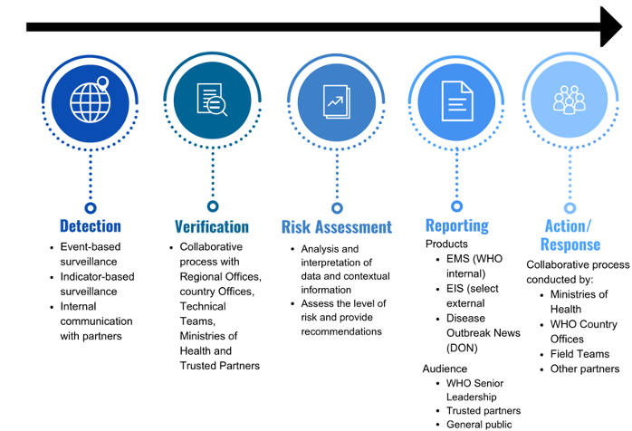
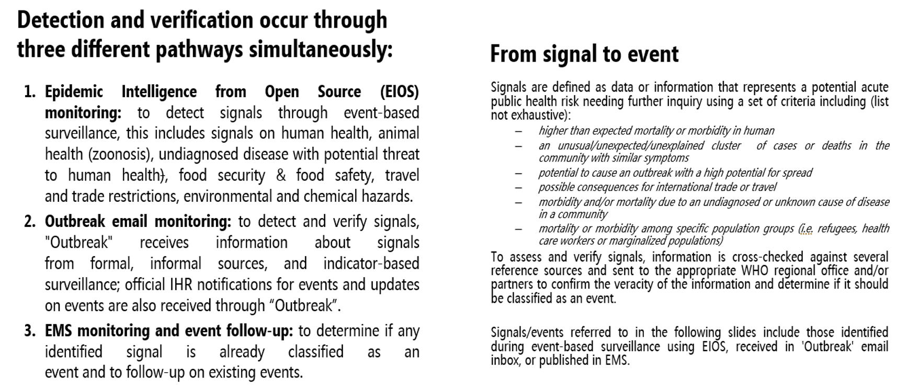
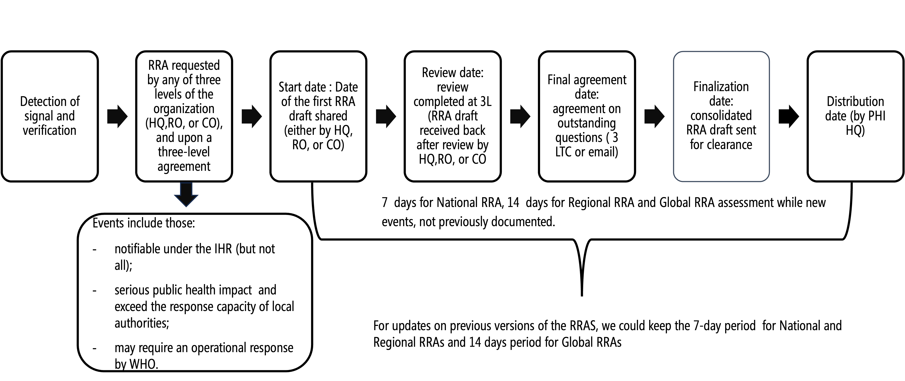
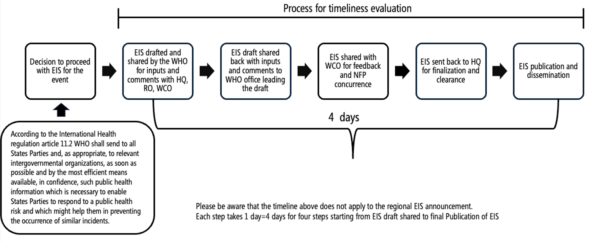
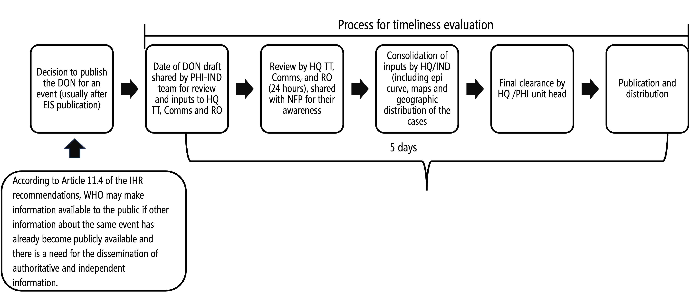

```{r setup, include=FALSE}
knitr::opts_chunk$set(echo = FALSE, 
                      warning = FALSE,
                      error = FALSE,
                      message = FALSE,
                      dev = 'png',
                      dpi = 300)

app <- T # change to FALSE for testing purposes and to read the files from disk in the Rmd (code below)
todays.date <- Sys.Date()
#-----------------------------------------------------------------
pacman::p_load(officer, officedown,
               ggplot2, tidyverse,
               lubridate, rvg,
               flextable, zoo,
               stringi, readxl,
               janitor, treemapify)


#-----------------------------------------------------------------
# Functions
simpleCap <- function(x) {
  s <- tolower(x)
  s <- strsplit(s, ' ')[[1]]
  str <- paste(toupper(substring(s, 1, 1)), substring(s, 2),
               sep = '', collapse = ' ')
  return(str)
}


#-----------------------------------------------------------------
# Report month
report.month <- format((todays.date) %m-% months(2), '%b %Y') #starting month
report.month2 <- c(format((todays.date) %m-% months(2), '%b %Y'), 
                   format((todays.date) %m-% months(1), '%b %Y'))
report.month.print <- paste0(format((todays.date) %m-% months(2), '%b'), '-', format((todays.date) %m-% months(1), '%b %Y'))

# SELECT WHO regions to print
# selected.region <- 'AFRO'
afro <- params$afro
amro <- params$amro
emro <- params$emro
euro <- params$euro
searo <- params$searo
wpro <- params$wpro
global <- params$global


# Region vector
all.selected.regions <- paste(
  c('AFRO', 'AMRO','EMRO','EURO','SEARO','WPRO','Global')[
    c(afro, amro, emro, euro, searo, wpro, global)
  ],
  collapse = ', ')


#-----------------------------------------------------------------
# DATA LOAD
#Load data EIOS articles screened
if(app){
  data_eios <- read_excel(params$eios)
} else {
  data_eios0 <- read_excel('EIOS data (5) (1).xlsx')
  data_eios <- read_excel('EIOS data (5) (1).xlsx',
                          col_types = c('numeric','numeric','numeric','numeric','numeric','numeric',
                                        # 'skip','skip','skip','skip','skip','skip',
                                        'date', 'numeric',
                                        rep('skip', times=ncol(data_eios0)-8)))
}

#------------------------------------------------------------------------------
#Load data Product tracker
if(app){
  data_pt <- read_excel(params$product_tracker,
                        sheet = "product tracker")
} else data_pt <- read_excel('Products tracker_v6 (22).xlsx',
                             sheet = "product tracker")

# cbind(colnames(data_pt), col_types) %>%
#   as.data.frame(.) %>%
#   filter(col_types=='date') %>% pull(V1)

# Columns that need to be Date objects
pt.date.cols <- c("daily signal tracker", "Daily signal tracker update entry",
                  "EMS entry", "RRA_Decision_date",                
                  "RRA_start_date","RRA_pub_date",                     
                  "EIS_decision_date", "EIS_start_HQ_receive_date",        
                  "EIS sent to \r\nRegional office", "EIS sent to NFP", 
                  "Feedback NFP", "EIS_pub_date",                     
                  "DON_start_date", "DON_pub_date")

# Getting the column types to re-read the file properly
col.types <- tibble(cols = colnames(data_pt),
                    types = unlist(lapply(sapply(data_pt, class), 
                                          FUN=function(a) a[1]))) %>% 
  mutate(ctypes = case_when(
    types == 'character' ~ 'text',
    types == 'logical' ~ 'numeric',
    types == 'POSIXct' ~ 'date',
    types == 'POSIXt' ~ 'date',
    types == 'numeric' ~ 'numeric',
    .default = 'text'
  ),
  ctypes = ifelse(cols %in% pt.date.cols, 'date', ctypes))


if(app){
  data_pt <- read_excel(params$product_tracker, 
                        sheet = "product tracker",
                        col_types = col.types$ctypes)
} else data_pt <- read_excel('Products tracker_v6 (22).xlsx', 
                             sheet = "product tracker",
                             col_types = col.types$ctypes)


#------------------------------------------------------------------------------
#Load data DON pipelinetracker
if(app){
  data_don <- read_excel(params$don_tracker)
} else data_don <- read_excel('DON_Pipeline_Tracker (12).xlsx')

# Columns that need to be Date objects
don.date.cols <- c('Date EIS published', 
                   'Date EIS published (Text)', 
                   'Date of first DON draft', 
                   'Date DON Published')

# Getting the column types to re-read the file properly
col.types <- tibble(cols = colnames(data_don),
                    types = unlist(lapply(sapply(data_don, class), 
                                          FUN=function(a) a[1]))) %>% 
  mutate(ctypes = case_when(
    types == 'character' ~ 'text',
    types == 'logical' ~ 'numeric',
    types == 'POSIXct' ~ 'date',
    types == 'POSIXt' ~ 'date',
    types == 'numeric' ~ 'numeric',
    .default = 'text'
  ),
  ctypes = ifelse(cols %in% don.date.cols, 'date', ctypes))


if(app){
  data_don <- read_excel(params$don_tracker,
                         col_types = col.types$ctypes)
} else data_don <- read_excel('DON_Pipeline_Tracker (12).xlsx',
                              col_types = col.types$ctypes)


#------------------------------------------------------------------------------
#Load Signal Characterization
if(app){
  sig.detail <- readxl::read_xlsx(params$sig_tracker,
                                  col_types = c("date", "text", "text", 
                                                "text", "text", "text", "date", "text", 
                                                "text", "text"),
                                  sheet = 'Signal Categorization v1.1') %>%
    clean_names() %>%
    filter(!is.na(hazard)) %>%
    mutate(date = as.Date(date),
           hazard.country = paste(hazard, country, sep=', '))
} else {
  sig.detail <- read_xlsx('Signal characterization tracker (1).xlsx',
                          col_types = c("date", "text", "text", 
                                        "text", "text", "text", "date", "text", 
                                        "text", "text"),
                          sheet = 'Signal Categorization v1.1') %>%
    clean_names() %>%
    filter(!is.na(hazard)) %>%
    mutate(date = as.Date(date),
           hazard.country = paste(hazard, country, sep=', '))
}


```

```{r include=FALSE}
# Product Tracker
# Create data frame for EMS data and select certain columns only from the dataframe for analyses
df_pt <- as.data.frame(data_pt) %>% 
  select("Status", "Product",                          
         "disease_condition", "country",                          
         "Countries (if multiple) or Region", "EMS event ID",                   
         "Need_RRA", "RRA_Decision_date",                
         "RRA_start_date", "RRA_pub_date",                     
         "RRA National risk level", "RRA Regional risk level",          
         "RRA Global risk level", "Need_EIS",                         
         "EIS_first_draft_by", "EIS_decision_date",                
         "EIS_start_HQ_receive_date", "EIS sent to \r\nRegional office",  
         "EIS sent to NFP", "Feedback NFP",                     
         "EIS_pub_date", "Need_DON",                         
         "DON_pub_date")

#rename column names
colnames(df_pt) <- c("status", 
                     "product", 
                     "disease",
                     "country",
                     "country_region", 
                     "EMS_ID",
                     "RRA", 
                     "RRA_date_decision",
                     "RRA_date_start",
                     "RRA_date_publication", 
                     "RRA_risk_nat", 
                     "RRA_risk_reg", 
                     "RRA_risk_glob",
                     "EIS",
                     "EIS_first_draft_by",
                     "EIS_date_decision",
                     "EIS_date_HQ",
                     "EIS_date_regional_office",
                     "EIS_sent_NFP",
                     "EIA_feedback_NFP",
                     "EIS_date_publication", 
                     "DON",
                     "DON_date_publication")


# DON
#create data frame for EMS data 
df_don <- as.data.frame(data_don) %>% 
  filter(!is.na(`Row last updated`)) %>% 
  select("Pipeline status", "Event ID",                       
         "Event", "Country",                        
         "Countries (If multiple)", "Country code",                   
         "Regional office", "Date EIS published",             
         "Date of first DON draft", "Date DON Published",            
         "Time between EIS and DON (days)")

#rename column names
colnames(df_don) <- c("status", 
                      "ID", 
                      "disease",
                      "country",
                      "country_additional", 
                      "country_code",
                      "region", 
                      "EIS_date_publication", 
                      "DON_date_first_draft", 
                      "DON_date_publication", 
                      "Time_EIS_DON_published" 
)


# EIOS - Dates cleaning
#create data frame for EMS data 
df_eios_plot <- as.data.frame(data_eios) %>% 
  rename(month = `...7`,
         read.total = `...8`) %>% 
  select(month, read.total) %>% 
  arrange(month) %>% 
  mutate(month = as.Date(month, format = "%m/%d/%y"))

```

```{r include=FALSE}
# RRA - data cleaning - dates
# replace NA values
df_pt$RRA_date_decision <- format(as.Date(df_pt$RRA_date_decision), "%Y-%m-%d")
df_pt$RRA_date_decision[is.na(df_pt$RRA_date_decision)] <- "1990-01-01"
df_pt$RRA_date_decision[df_pt$RRA_date_decision=="Not applicable"] <- "1990-01-01"
df_pt$RRA_date_decision[df_pt$RRA_date_decision=="Pending"] <- "1990-01-01"


df_pt$RRA_date_publication <- format(as.Date(df_pt$RRA_date_publication), "%Y-%m-%d")
df_pt$RRA_date_publication[is.na(df_pt$RRA_date_publication)] <- "1990-01-01"
df_pt$RRA_date_publication[df_pt$RRA_date_publication=="Not applicable"] <- "1990-01-01"


df_pt$RRA_date_start <- format(as.Date(df_pt$RRA_date_start), "%Y-%m-%d")
df_pt$RRA_date_start[is.na(df_pt$RRA_date_start)] <- "1990-01-01"
df_pt$RRA_date_start[df_pt$RRA_date_start=="Not applicable"] <- "1990-01-01"

#create date variables for dates
df_pt$RRA_date_decision <- as.Date(df_pt$RRA_date_decision)
df_pt$RRA_date_publication <- as.Date(df_pt$RRA_date_publication)
df_pt$RRA_date_start <- as.Date(df_pt$RRA_date_start)

#create year-month variable
df_pt$RRA_pub_year_month <- format(df_pt$RRA_date_publication, "%m/%y")
df_pt$RRA_pub_year_month <- as.Date(paste0("01/",df_pt$RRA_pub_year_month), format="%d/%m/%y")


# RRA data cleaning - variables
df_pt$RRA[df_pt$RRA=="yes"] <- "Yes"


# EIS - data cleaning - dates
# replace NA values in dates
df_pt$EIS_date_decision <- format(as.Date(df_pt$EIS_date_decision), "%Y-%m-%d")
df_pt$EIS_date_decision[is.na(df_pt$EIS_date_decision)] <- "1990-01-01"
df_pt$EIS_date_decision[df_pt$EIS_date_decision=="Not applicable"] <- "1990-01-01"

df_pt$EIS_date_HQ <- format(as.Date(df_pt$EIS_date_HQ), "%Y-%m-%d")
df_pt$EIS_date_HQ[is.na(df_pt$EIS_date_HQ)] <- "1990-01-01"
df_pt$EIS_date_HQ[df_pt$EIS_date_HQ=="Not applicable"] <- "1990-01-01"

df_pt$EIS_date_regional_office <- format(as.Date(df_pt$EIS_date_regional_office), "%Y-%m-%d")
df_pt$EIS_date_regional_office[is.na(df_pt$EIS_date_regional_office)] <- "1990-01-01"
df_pt$EIS_date_regional_office[df_pt$EIS_date_regional_office=="Not applicable"] <- "1990-01-01"

df_pt$EIS_date_publication <- format(as.Date(df_pt$EIS_date_publication), "%Y-%m-%d")
df_pt$EIS_date_publication[is.na(df_pt$EIS_date_publication)] <- "1990-01-01"
df_pt$EIS_date_publication[df_pt$EIS_date_publication=="Not applicable"] <- "1990-01-01"


#create date variables for dates
df_pt$EIS_date_decision <- as.Date(df_pt$EIS_date_decision)
df_pt$EIS_date_HQ <- as.Date(df_pt$EIS_date_HQ)
df_pt$EIS_date_regional_office <- as.Date(df_pt$EIS_date_regional_office)
df_pt$EIS_date_publication <- as.Date(df_pt$EIS_date_publication)

#create year-month variable
df_pt$EIS_pub_year_month <- format(df_pt$EIS_date_publication, "%m/%y")
df_pt$EIS_pub_year_month <- as.Date(paste0("01/",df_pt$EIS_pub_year_month), format="%d/%m/%y")

# EIS data cleaning - variables
df_pt$EIS[df_pt$EIS=="yes"] <- "Yes"
df_pt$EIS[df_pt$EIS=="no"] <- "No"

# DON data cleaning
# df_don %>% filter(is.na(df_don$DON_date_publication))
df_don$DON_date_publication <- format(as.Date(df_don$DON_date_publication), "%d-%b %Y")
df_don$DON_date_publication[is.na(df_don$DON_date_publication)] <- "01-Jan-1990"
df_don$DON_date_publication <- as.Date(df_don$DON_date_publication, format="%d-%b %Y")

df_don$EIS_date_publication <- format(as.Date(df_don$EIS_date_publication), "%d-%b %Y")
df_don$EIS_date_publication[is.na(df_don$EIS_date_publication)] <- "01-Jan-1990"
df_don$EIS_date_publication <- as.Date(df_don$EIS_date_publication, format="%d-%b %Y")


df_don$DON_date_first_draft <- format(as.Date(df_don$DON_date_first_draft), "%d-%b %Y")
df_don$DON_date_first_draft[is.na(df_don$DON_date_first_draft)] <- "01-Jan-1990"
df_don$DON_date_first_draft <- as.Date(df_don$DON_date_first_draft, format="%d-%b %Y")


# Modify EIS date publication
df_don <- df_don %>%
  mutate(EIS_date_publication =
           as.Date(ifelse(EIS_date_publication=='1990-01-01',
                          DON_date_first_draft,
                          EIS_date_publication)))


# Create year-month variable
df_don$DON_pub_year_month <- format(as.Date(df_don$DON_date_publication, format="%d-%b %Y"), "%m/%y")
df_don$DON_pub_year_month <- as.Date(paste0("01/",df_don$DON_pub_year_month), format="%d/%m/%y")

```

## Preamble

**Aim**

This presentation gives an overview of public health intelligence (PHI) in the Health Emergencies programme with a focus on activities globally that took place in `r format(as.Date(as.yearmon(report.month)), '%b %Y')` and with a deep dive on PHI activities in the following WHO region/s: `r all.selected.regions`

\ 

**Acknowledgments**

This presentation would not be possible without the work of WHO colleagues across the three levels of the Organization. We would like to thank, in particular, PHI and DVA unit/team members at HQ and ROs as well as colleagues in COs involved in signal verification and information product development.

\ 

**Questions/contact:**

If any further questions, please contact Dr. Esther Hamblion, Unit Head, [hamblione\@who.int](hamblione@who.int)

## **Public health intelligence activities: Overview**




##  



## **Outline**

**A. Global overview**

1.  Signals
2.  Events
3.  Information products
4.  Timeliness of information products

<br>

**B. Regional Deep dive -- WHO `r all.selected.regions`**

1.  EIS, EMS, RRA, DON - trends and timelines of information products
2.  Key projects

<br>

**C. Conclusion/summary**

## **Part A - Global overview**

## **Data sources and methods for global overview section**

**Data sources:**

-   Data extract from EIOS for pieces of information screened/read

-   Product tracker and DON pipeline tracker, two PHI databases used to document and track information products

\ 

**Data cleaning and analysis:**

-   Data was extracted on `r format(todays.date, '%d %b %Y')` from the data sources

-   Data cleaning and analysis was done in R using R Studio

-   Data was presented as Tables or Figures

\ 

**Commonly used abbreviations:**

-   PHI: Public health intelligence

-   RRA: Rapid risk assessment

-   EIS: Event information site

-   DON: Disease outbreak news

\ 

**Note:** There might be differences in month to month reporting due to ongoing updates and database data cleaning.

## **Signals**

```{r layout='Title Only'}

```

## **Triaging and assessment of the signals**


## **EIOS: Raw signals scanned and triangulated**

::: columns
::: column
```{r}
# Create figures information products published over time
fig_EIOS <- df_eios_plot %>% 
  filter(month >= as.Date(as.yearmon(report.month)) %m-% months(4) & 
           month < as.Date(as.yearmon(report.month)) %m+% months(2)) %>% 
  ggplot(aes(x = month, y = read.total)) +
  geom_bar(stat='identity', colour="black", fill="#56B4E9")+
  scale_x_date(date_breaks = "1 month", date_labels = "%b %Y")+
  expand_limits(y=c(0,70000))+
  scale_y_continuous(breaks=seq(0, 70000, 10000))+  # Ticks from 0-60, every 5
  theme(axis.ticks=element_blank())+
  labs(x="Date", y="Pieces of information read/screened (N)")+
  theme_bw()

fig_EIOS

```
:::

::: column
```{r include=FALSE}
# Average read in last 3 months
# sum.stats <- summary(
#   df_eios_plot$Read[(nrow(df_eios_plot)-2):nrow(df_eios_plot)]
# )


# Get the first day of the current month
first_day_current_month <- as.Date(format(todays.date, "%Y-%m-01"))

# Get the first day of the previous month (February)
first_day_prev_month <- as.Date(format(first_day_current_month - 1, "%Y-%m-01"))

# Get the first day of the month before the previous month (January)
first_day_two_months_ago <- as.Date(format(first_day_prev_month - 1, "%Y-%m-01"))

# # Get the last day of the previous month (February)
# last_day_prev_month <- first_day_current_month - 1
# 
# # Format the result string
# date.range <- paste0(
#   format(first_day_two_months_ago, "1 %b"),
#   "-",
#   format(last_day_prev_month, "%d %b %Y")
# )

current.eios.report <- df_eios_plot %>% 
  filter(month %in% c(first_day_two_months_ago, first_day_prev_month)) %>% 
  summarise(total = sum(read.total))

total.eios.report <- df_eios_plot %>% 
  filter(month >= as.Date(as.yearmon(report.month)) %m-% months(4) & 
           month < as.Date(as.yearmon(report.month)) %m+% months(2)) %>% 
  summarise(average = round(mean(read.total, na.rm=T), 0))


```

### Key points:

-   A total of `r current.eios.report$total` raw signals were scanned and triangulated in `r report.month.print`.

-   An average of `r total.eios.report$average` signals were scanned and triangulated in `r report.month.print`.

-   Please note, starting 1 January 2025 and following a board review and comparison, the PHI unit at HQ revised their EIOS strategy and streamlined scanning to one board (down from two) with improved specificity. This led to a reduction in the number of signals scanned monthly since the start of 2025.

:::
:::

## **Assessing and Triaging of signals - `r report.month.print`**

```{r ph=officer::ph_location_right()}
sig.detail.sub <- sig.detail %>% 
  filter(date >= as.Date(as.yearmon(report.month)) &
           date < as.Date(as.yearmon(report.month)) %m+% months(2)) %>% 
  select(categorization) %>% 
  mutate(
    categorization = case_when(
      categorization == "SFA" ~ "Shared for awareness",
      categorization == "DHQP" ~ "Discard for HQ PHI",
      categorization == "RTM" ~ "Real time monitoring",
      categorization == "RFI" ~ "Request for information",
      categorization == "Verification" ~ "Request for verification",
      TRUE ~ categorization
    )) %>% 
  group_by(categorization) %>%
  summarise(n = n())


n.raw <- sum(sig.detail.sub$n)

#n.shared.awareness <- sum(sig.detail.sub$categorization=="SFA")

title <- paste0('Signal categorization of the raw signals (n=', n.raw,')')


# Create the treemap
treemap <- sig.detail.sub %>% 
  ggplot(aes(area = n, fill = categorization, label = paste0(categorization, ", ", n))) +
  geom_treemap(color = "white") +
  geom_treemap_text(
    fontface = "bold", 
    colour = "black", 
    place = "center",
    grow = TRUE
  ) +
  scale_fill_manual(values = c("#8DA0CB", "#B3CDE3", "#4575B4", "#91BFDB", "#74ADD1")) +
  ggtitle(title) +
  theme(
    plot.title = element_text(size = 14, face = "bold", hjust = 0.5),
    legend.position = "none"
  )

rvg::dml(ggobj = treemap)


```


*DHQP= Discard for HQ PHI, RFI=request for information, RTM=Real time monitoring, SFA= Shared for awareness, Verification*
*Note: A single signal can be linked to multiple categories based on actions taken*


## **Events/nKey Message**

```{r layout='Title Only'}

```


## **EMS New Events Reported by Region and Month (n=XXX)**


```{r eval = FALSE}
ems.data <- read_excel("~/Downloads/EMS data (1) (1).xlsx") %>% 
  clean_names() %>% 
  filter(!is.na(x1)) %>% 
  pivot_longer(
    cols = !starts_with('x'),
    names_to = "month",
    values_to = "n.events"
  ) %>% 
  mutate(
    month = str_replace(sub("^(([^_]*_[^_]*)).*", "\\1", month), '_', ' '),
    month = paste0(toupper(substring(month, 1, 1)), substring(month, 2)),
    month = ifelse(grepl('Sept', month), str_replace(month, 'Sept', 'Sep'), month),
    month2 = as.Date(paste("01", month), format = "%d %b %Y"))

```

*NB: data entry protocols and data management practices can vary between WHO Regions for recording events in EMS.*


## **EMS New Events Reported by Region and Month, substantiated  (n=XXX)**


## **EMS updates for current and closed events in the past 6 months by Region and Hazard (n=XXX)**

## **EMS updates for current and closed events in the past 6 months by Region and Hazard – substantiated events (n=XXX)**


## **Information Products**

## **Information products: Key trends (1)**

```{r}
df_prod_dy_count_country_eis <- df_pt %>% 
  filter(EIS=="Yes") %>%
  filter(EIS_pub_year_month >= 
           as.Date(as.yearmon(report.month)) &
           EIS_pub_year_month < 
           as.Date(as.yearmon(report.month)) %m+% months(2)) %>%
  group_by (EIS_pub_year_month, disease, country) %>%
  summarise(sum.eis=n()) %>%
  mutate(disease = disease,
         country = stringi::stri_trans_totitle(country))


df_prod_dy_count_country_rra <- df_pt %>% 
  filter(RRA=="Yes") %>%
  filter(RRA_pub_year_month >= 
           as.Date(as.yearmon(report.month)) &
           RRA_pub_year_month < 
           as.Date(as.yearmon(report.month)) %m+% months(2)) %>%
  group_by (RRA_pub_year_month, disease, country) %>%
  summarise(sum.rra=n()) %>%
  mutate(disease = disease,
         country = stringi::stri_trans_totitle(country))


df_prod_dy_count_country_don <- df_don %>% 
  filter(status=="Published") %>%
  filter(DON_pub_year_month >= 
           as.Date(as.yearmon(report.month)) &
           DON_pub_year_month < 
           as.Date(as.yearmon(report.month)) %m+% months(2)) %>%
  group_by (DON_pub_year_month, disease, country) %>%
  summarise(sum.don=n()) %>%
  mutate(disease = disease,
         country = stringi::stri_trans_totitle(country))


# Rename values in disease column
df_prod_dy_count_country_rra$disease[str_sub(df_prod_dy_count_country_rra$disease, 1,5)=="Crime"] <- "Crimean-Congo hemorrhagic fever"
df_prod_dy_count_country_rra$disease[str_sub(df_prod_dy_count_country_rra$disease, 1,5)=="Monke"] <- "mpox"
df_prod_dy_count_country_rra$disease[str_sub(df_prod_dy_count_country_rra$disease, 1,5)=="Lassa"] <- "Lassa fever"
df_prod_dy_count_country_rra$disease[str_sub(df_prod_dy_count_country_rra$disease, 1,5)=="Yello"] <- "Yellow fever"
df_prod_dy_count_country_rra$disease[df_prod_dy_count_country_rra$disease=="Hepatitis (unspecified)"] <- "Acute hepatitis of unknown aetiology"

df_prod_dy_count_country_eis$disease[str_sub(df_prod_dy_count_country_eis$disease, 1,5)=="Crime"] <- "Crimean-Congo hemorrhagic fever"
df_prod_dy_count_country_eis$disease[str_sub(df_prod_dy_count_country_eis$disease, 1,5)=="Monke"] <- "mpox"
df_prod_dy_count_country_eis$disease[df_prod_dy_count_country_eis$disease=="Acute febrile jaundice syndrome"] <- "Acute hepatitis of unknown aetiology"
df_prod_dy_count_country_eis$disease[df_prod_dy_count_country_eis$disease=="Hepatitis (unspecified)"] <- "Acute hepatitis of unknown aetiology"

df_prod_dy_count_country_don$disease[str_sub(df_prod_dy_count_country_don$disease, 1,5)=="Dengu"] <- "Dengue"
#df_prod_dy_count_country_don$disease[str_sub(df_prod_dy_count_country_don$disease, 1,5)=="Influ"] <- "Avian influenza"
#df_prod_dy_count_country_don$disease[str_sub(df_prod_dy_count_country_don$disease, 1,5)=="Infue"] <- "Avian influenza"
df_prod_dy_count_country_don$disease[str_sub(df_prod_dy_count_country_don$disease, 1,5)=="Monke"] <- "mpox"
df_prod_dy_count_country_don$disease[str_sub(df_prod_dy_count_country_don$disease, 1,5)=="Lassa"] <- "Lassa fever"
df_prod_dy_count_country_don$disease[str_sub(df_prod_dy_count_country_don$disease, 1,5)=="Marbu"] <- "Marburg"
df_prod_dy_count_country_don$disease[df_prod_dy_count_country_don$disease=="Acute hepatitis of unknown aetiology in children - Multi-country"] <- "Acute hepatitis of unknown aetiology"
df_prod_dy_count_country_don$disease[df_prod_dy_count_country_don$disease=="Sudan Virus disease"] <- "Sudan virus disease"
df_prod_dy_count_country_don$disease[df_prod_dy_count_country_don$disease=="Invasive Group A Streptococcus infection"] <- "Scarlet fever and invasive Group A Streptococcus infection"
df_prod_dy_count_country_don$disease[df_prod_dy_count_country_don$disease=="Nipah virus disease"] <- "Nipah"
df_prod_dy_count_country_don$disease[df_prod_dy_count_country_don$disease=="Enterovirus Infection (E-11)"] <- "Enterovirus"
df_prod_dy_count_country_don$disease[df_prod_dy_count_country_don$disease=="Myocarditis"] <- "Neonatal myocarditis"

# Final table
info.products.table <- merge(merge(df_prod_dy_count_country_rra, 
                                   df_prod_dy_count_country_eis,
                                   by=c('disease', 'country'), all = TRUE),
                             df_prod_dy_count_country_don,
                             by=c('disease', 'country'), all = TRUE) %>%
  select(-RRA_pub_year_month, -EIS_pub_year_month, -DON_pub_year_month) %>%
  mutate(sum.rra=ifelse(is.na(sum.rra), 0, sum.rra),
         sum.eis=ifelse(is.na(sum.eis), 0, sum.eis),
         sum.don=ifelse(is.na(sum.don), 0, sum.don)) %>%
  mutate(total = sum.rra + sum.eis + sum.don) 

```


```{r}
# Get last year's data
# Last year strings
year <- as.numeric(sub(".* (\\d{4})$", "\\1", report.month)) - 1
months <- sub(" (\\d{4})$", "", report.month)
# Combine updated year with original months
report.month.last.year <- paste0(months, " ", year)


# Print string
year <- as.numeric(sub(".* (\\d{4})$", "\\1", report.month.print)) - 1
months <- sub(" (\\d{4})$", "", report.month.print)
report.month.print.last.year <- paste0(months, " ", year)

# Tables for last year
df_prod_dy_count_country_eis_last_year <- df_pt %>% 
  filter(EIS=="Yes") %>%
  filter(EIS_pub_year_month >= 
           as.Date(as.yearmon(report.month.last.year)) &
           EIS_pub_year_month < 
           as.Date(as.yearmon(report.month.last.year)) %m+% months(2)) %>%
  group_by (EIS_pub_year_month, disease, country) %>%
  summarise(sum.eis=n()) %>%
  mutate(disease = disease,
         country = stringi::stri_trans_totitle(country))


df_prod_dy_count_country_rra_last_year <- df_pt %>% 
  filter(RRA=="Yes") %>%
  filter(RRA_pub_year_month >= 
           as.Date(as.yearmon(report.month.last.year)) &
           RRA_pub_year_month < 
           as.Date(as.yearmon(report.month.last.year)) %m+% months(2)) %>%
  group_by (RRA_pub_year_month, disease, country) %>%
  summarise(sum.rra=n()) %>%
  mutate(disease = disease,
         country = stringi::stri_trans_totitle(country))


df_prod_dy_count_country_don_last_year <- df_don %>% 
  filter(status=="Published") %>%
  filter(DON_pub_year_month >= 
           as.Date(as.yearmon(report.month.last.year)) &
           DON_pub_year_month < 
           as.Date(as.yearmon(report.month.last.year)) %m+% months(2)) %>%
  group_by (DON_pub_year_month, disease, country) %>%
  summarise(sum.don=n()) %>%
  mutate(disease = disease,
         country = stringi::stri_trans_totitle(country))

# Final table
info.products.table.last.year <- merge(merge(df_prod_dy_count_country_rra_last_year, 
                                             df_prod_dy_count_country_eis_last_year,
                                             by=c('disease', 'country'), all = TRUE),
                                       df_prod_dy_count_country_don_last_year,
                                       by=c('disease', 'country'), all = TRUE) %>%
  select(-RRA_pub_year_month, -EIS_pub_year_month, -DON_pub_year_month) %>%
  mutate(sum.rra=ifelse(is.na(sum.rra), 0, sum.rra),
         sum.eis=ifelse(is.na(sum.eis), 0, sum.eis),
         sum.don=ifelse(is.na(sum.don), 0, sum.don)) %>%
  mutate(total = sum.rra + sum.eis + sum.don) 


```

```{r}
# Get all products for 6 months
df_rra_count <- df_pt %>% 
  filter(RRA=="Yes") %>% 
  filter(RRA_pub_year_month >= 
           as.Date(as.yearmon(report.month)) %m-% months(4) &
           RRA_pub_year_month < 
           as.Date(as.yearmon(report.month)) %m+% months(2)) %>% 
  group_by(RRA_pub_year_month) %>% 
  summarise(sum.rra=n())

df_eis_count <- df_pt %>% 
  filter(EIS=="Yes") %>%
  filter(EIS_pub_year_month >= 
           as.Date(as.yearmon(report.month)) %m-% months(4) &
           EIS_pub_year_month < 
           as.Date(as.yearmon(report.month)) %m+% months(2)) %>% 
  group_by (EIS_pub_year_month) %>% 
  summarise(sum.eis=n())

df_don_count <- df_don %>% 
  filter(status=="Published") %>% 
  filter(DON_pub_year_month >= 
           as.Date(as.yearmon(report.month)) %m-% months(4) &
           DON_pub_year_month < 
           as.Date(as.yearmon(report.month)) %m+% months(2)) %>% 
  filter(!is.na(DON_pub_year_month)) %>% 
  group_by (DON_pub_year_month) %>% 
  summarise(sum.don=n())

# Rename colnames
colnames(df_rra_count)[1] <- "pub_year_month"
colnames(df_eis_count)[1] <- "pub_year_month"
colnames(df_don_count)[1] <- "pub_year_month"

# Create new dataframe
df_prod_count <- df_eis_count %>% 
  full_join(df_rra_count, by="pub_year_month") %>% 
  full_join(df_don_count, by="pub_year_month") 

df_prod_count[is.na(df_prod_count)] <- 0

df_prod_count <- df_prod_count %>% 
  mutate(total=sum.eis+sum.rra+sum.don)

todays.date <- todays.date
# OUTPUT TABLE
current.month <- df_prod_count %>%
  mutate(pub_year_month = format(pub_year_month, format='%b %Y')) %>%
  filter(pub_year_month %in% report.month2) %>%
  relocate(sum.rra, .after=pub_year_month) %>% 
  summarise(
    across(where(is.character), ~ paste0('Total ', report.month.print)),  # Set string column to "Total"
    across(where(is.numeric), sum)          # Sum all numeric columns
  )

previous.months <- df_prod_count %>% 
  filter(pub_year_month < as.Date(as.yearmon(report.month))) %>%
  mutate(pub_year_month = format(pub_year_month, format='%b %Y'),
         min=min(total), 
         max=max(total)) %>%
  summarise(
    pub_year_month = paste0('Previous 4 months - ', format(todays.date %m-% months(6), '%b'),'-',format(todays.date %m-% months(3), '%b'), ' (Min-Max)'),
    sum.rra = paste0('(',min(sum.rra),'-',max(sum.rra),')'),
    sum.eis = paste0('(',min(sum.eis),'-',max(sum.eis),')'),
    sum.don = paste0('(',min(sum.don),'-',max(sum.don),')'),
    total = paste0('(',min(total),'-',max(total),')')
  )

```

\ 

- Increase/ decrease/ similar in # of information products produced in  `r paste0(report.month.print, ' (n=', sum(info.products.table$total, na.rm=T),')')`, compared to `r paste0(report.month.print.last.year, ' (n=', sum(info.products.table.last.year$total, na.rm=T),')')`

\ 

- Various information products related to different events have been published between `r format(as.Date(as.yearmon(report.month)) %m-% months(4), '%b %Y')` and `r format(as.Date(as.yearmon(report.month)) %m+% months(1), '%b %Y')`, underscoring wide range of aetiologies/disease/conditions and countries affected which PHI operates.

\ 

- PHI team leads/contributes to various Global, regional or multi-country information products related to the G3/P3 emergencies. This includes situation reports for G3 events Cholera, mpox, Sudan Conflict and refugee crisis. A total of XX number of situation reports were published in Jan-Feb 2025. 


## **Information products: overview published products (1)**

In **`r report.month.print`**, of the **`r current.month$total` RRA, EIS and DONs published:**

Information products were produced across `r nrow(info.products.table)` **(confirm number in previous slide)** events, in particular **XXX**

The PHI Unit is **also involved** in **several other information products** (non RRA, EIS, or DON), including **technical briefs and situation reports**, that are related to ongoing public health events.

The **main recurrent information products** currently are: 

- **Global Cholera situation report:** First situation report published in March and second situation report developed in April (published in May).

- **Weekly Senior Leadership Report (WSLR):** Acute Events and Graded Emergencies. Published weekly. **XX** WSLRs have been published since the week 13 - 17 November 2023, and as of **XX XXX 2025**. 

- **Multi-country outbreak of mpox, External situation report:** Since the PHEIC declaration on 14 August 2024, **XX*** reports have been issued, with the most recent one released on **XX XXX 2025**.

- **WHE Emergency Report in WER:** Published monthly and includes summaries of DONs and sitreps published the previous month. **XXX** published, including **XXX** in the last month.


Data for these information products is not included in this slide deck (for now) but substantially contributes to the workload – especially as health emergencies/outbreaks become more protracted.


## **Information products: overview published products (2)**


```{r ft.top = 1.5}
# Rendering Flextable
if(nrow(info.products.table) > 0){
  # rbind(info.products.table,
  #       c('', 'Total', sum(info.products.table$sum.rra), 
  #         sum(info.products.table$sum.eis), 
  #         sum(info.products.table$sum.don),
  #         sum(info.products.table$total))) %>%
  rbind(info.products.table,
        rbind(current.month,
              previous.months) %>% 
          mutate(country = NA) %>% 
          rename(disease = pub_year_month) %>%
          relocate(country, .after = disease)) %>% 
    as.data.frame(.) %>% 
    flextable() %>%
    set_header_labels(values = list(
      disease = 'Disease/Condition',
      country = 'Country',
      sum.rra = 'RRA',
      sum.eis = 'EIS',
      sum.don = 'DON',
      total = 'Total'
    )) %>%
    align(j = 3:6, align='center', part='all') %>%
    bold(bold = TRUE, part = 'header') %>%
    hline(i=nrow(info.products.table), part='body') %>%
    bold(i = nrow(info.products.table)+1, bold = TRUE, part = 'body') %>%
    # width(j=1, width=2)
    autofit()
}

```


## **Information products: Trends RRA, EIS, DON**

::: columns
::: column
```{r}
# Bar chart of products over time - by product
#create dataframe
df_fig_count <- df_prod_count %>% 
  filter(pub_year_month < as.Date(as.yearmon(report.month)) %m+% months(2)) %>% 
  gather(key="product", value="number", 2:5)

# Rename values and create factor variable
df_fig_count <- df_fig_count %>% 
  mutate(product = case_when(
    product == 'sum.eis' ~ 'EIS published',
    product == 'sum.rra' ~ 'RRA published',
    product == 'sum.don' ~ 'DON published',
    product == 'total' ~ 'All information products published'
  ),
  product = factor(product, levels = c("All information products published", 
                                       "RRA published", 
                                       "EIS published", 
                                       "DON published")))


# Create figures information products published over time
fig_infoprod <- ggplot(data=df_fig_count, aes(x = pub_year_month, y = number)) +
  geom_bar(stat='identity', colour="black", fill="#56B4E9") +
  geom_text(aes(label = number, vjust=-0.4)) +
  theme_bw() +
  theme(axis.ticks=element_blank(),
        axis.text.x = element_text(angle = 45, hjust = 1),
        legend.position="none") +
  scale_x_date(date_breaks = "1 month", date_labels = "%b %Y") +
  expand_limits(y=c(0,40)) +
  labs(x="", y="Number") +
  facet_wrap(.~product, nrow = 2)

fig_infoprod


df_fig_count_text <- df_fig_count %>% 
  arrange(pub_year_month) %>% 
  mutate(month = format(pub_year_month, '%B'),
         pub_year_month = format(pub_year_month, '%b %Y')) %>% 
  filter(pub_year_month %in% report.month2) %>% 
  mutate(text = paste0(month,' (n=' ,number,')')) %>% 
  select(product, text)


```
:::

::: column
**Overall\*:** Increase/Decrease/No change in overall information products published in `r (df_fig_count_text %>% filter(product == 'All information products published') %>% pull(text))[1]` compared to `r (df_fig_count_text %>% filter(product == 'All information products published') %>% pull(text))[2]`

\ 

**RRA:** Increase/Decrease/No change in overall information products published in `r (df_fig_count_text %>% filter(product == 'RRA published') %>% pull(text))[1]` compared to `r (df_fig_count_text %>% filter(product == 'RRA published') %>% pull(text))[2]`

\ 

**EIS:** Increase/Decrease/No change in overall information products published in `r (df_fig_count_text %>% filter(product == 'EIS published') %>% pull(text))[1]` compared to `r (df_fig_count_text %>% filter(product == 'EIS published') %>% pull(text))[2]`

\ 

**DON:** Increase/Decrease/No change in overall information products published in `r (df_fig_count_text %>% filter(product == 'DON published') %>% pull(text))[1]` compared to `r (df_fig_count_text %>% filter(product == 'DON published') %>% pull(text))[2]`

\ 

\**Only includes RRA, EIS and DON. Does not include other information products in which the PHI unit is involved or leads on.*
:::
:::

## **Information products: Disease/Condition Trends**

```{r fig.width=40, fig.height=25}
# Data by disease and month-year
df_rra_dy_count <- df_pt %>%   
  filter(RRA=="Yes") %>%   
  filter(RRA_pub_year_month >= 
           as.Date(as.yearmon(report.month)) %m-% months(4)) %>%   
  group_by (RRA_pub_year_month, disease) %>%   
  summarise(sum.rra=n()) %>% 
  rename(pub_year_month = RRA_pub_year_month)


df_eis_dy_count <- df_pt %>%   
  filter(EIS=="Yes") %>%  
  filter(EIS_pub_year_month >= 
           as.Date(as.yearmon(report.month)) %m-% months(4)) %>%
  group_by (EIS_pub_year_month, disease) %>%
  summarise(sum.eis=n()) %>% 
  rename(pub_year_month = EIS_pub_year_month)


df_don_dy_count <- df_don %>%   
  filter(status=="Published") %>%   
  filter(DON_pub_year_month >= 
           as.Date(as.yearmon(report.month)) %m-% months(4)) %>%
  filter(!is.na(DON_pub_year_month)) %>%   
  group_by (DON_pub_year_month, disease) %>%   
  summarise(sum.don=n()) %>% 
  rename(pub_year_month = DON_pub_year_month)


#rename values in disease column
df_rra_dy_count$disease[str_sub(df_rra_dy_count$disease, 1,5)=="Avian"] <- "Avian influenza"
df_rra_dy_count$disease[str_sub(df_rra_dy_count$disease, 1,5)=="Shige"] <- "Shigellosis"
df_rra_dy_count$disease[str_sub(df_rra_dy_count$disease, 1,5)=="Crime"] <- "Crimean-Congo hemorrhagic fever"
df_rra_dy_count$disease[str_sub(df_rra_dy_count$disease, 1,5)=="Monke"] <- "mpox"
df_rra_dy_count$disease[str_sub(df_rra_dy_count$disease, 1,5)=="Lassa"] <- "Lassa fever"
df_rra_dy_count$disease[str_sub(df_rra_dy_count$disease, 1,5)=="Yello"] <- "Yellow fever"
df_rra_dy_count$disease[str_sub(df_rra_dy_count$disease, 1,5)=="Polio"] <- "Polio"
df_rra_dy_count$disease[str_sub(df_rra_dy_count$disease, 1,4)=="Wild"] <- "Polio"
df_rra_dy_count$disease[df_rra_dy_count$disease=="Hepatitis (unspecified)"] <- "Acute hepatitis of unknown aetiology"

df_eis_dy_count$disease[str_sub(df_eis_dy_count$disease, 1,5)=="Avian"] <- "Avian influenza"
df_eis_dy_count$disease[str_sub(df_eis_dy_count$disease, 1,5)=="Swine"] <- "Swine influenza variant"
df_eis_dy_count$disease[str_sub(df_eis_dy_count$disease, 1,5)=="Influ"] <- "Avian influenza"
df_eis_dy_count$disease[str_sub(df_eis_dy_count$disease, 1,5)=="Shige"] <- "Shigellosis"
df_eis_dy_count$disease[str_sub(df_eis_dy_count$disease, 1,5)=="Crime"] <- "Crimean-Congo hemorrhagic fever"
df_eis_dy_count$disease[str_sub(df_eis_dy_count$disease, 1,5)=="Polio"] <- "Polio"
df_eis_dy_count$disease[str_sub(df_eis_dy_count$disease, 1,4)=="Wild"] <- "Polio"
df_eis_dy_count$disease[str_sub(df_eis_dy_count$disease, 1,5)=="Monke"] <- "mpox"
df_eis_dy_count$disease[str_sub(df_eis_dy_count$disease, 1,5)=="Yello"] <- "Yellow fever"
df_eis_dy_count$disease[df_eis_dy_count$disease=="Acute febrile jaundice syndrome"] <- "Acute hepatitis of unknown aetiology"
df_eis_dy_count$disease[df_eis_dy_count$disease=="Hepatitis (unspecified)"] <- "Acute hepatitis of unknown aetiology"
df_eis_dy_count$disease[df_eis_dy_count$disease=="Hepatitis (unspecified)"] <- "Acute hepatitis of unknown aetiology"
df_eis_dy_count$disease[df_eis_dy_count$disease=="Hepatitis (unspecified)"] <- "Acute hepatitis of unknown aetiology"

df_don_dy_count$disease[str_sub(df_don_dy_count$disease, 1,5)=="Dengu"] <- "Dengue"
df_don_dy_count$disease[str_sub(df_don_dy_count$disease, 1,5)=="Influ"] <- "Avian influenza"
df_don_dy_count$disease[str_sub(df_don_dy_count$disease, 1,5)=="Infue"] <- "Avian influenza"
df_don_dy_count$disease[str_sub(df_don_dy_count$disease, 1,5)=="Avian"] <- "Avian influenza"
df_don_dy_count$disease[str_sub(df_don_dy_count$disease, 1,5)=="Monke"] <- "mpox"
df_don_dy_count$disease[str_sub(df_don_dy_count$disease, 1,5)=="Lassa"] <- "Lassa fever"
df_don_dy_count$disease[str_sub(df_don_dy_count$disease, 1,5)=="Circu"] <- "Polio"
df_don_dy_count$disease[str_sub(df_don_dy_count$disease, 1,4)=="Wild"] <- "Polio"
df_don_dy_count$disease[str_sub(df_don_dy_count$disease, 1,5)=="Wild "] <- "Polio"
df_don_dy_count$disease[str_sub(df_don_dy_count$disease, 1,5)=="cVDPV"] <- "Polio"
df_don_dy_count$disease[str_sub(df_don_dy_count$disease, 1,5)=="WPV1"] <- "Polio"
df_don_dy_count$disease[str_sub(df_don_dy_count$disease, 1,5)=="Marbu"] <- "Marburg"
df_don_dy_count$disease[str_sub(df_don_dy_count$disease, 1,3)=="XDR"] <- "Shigellosis"
df_don_dy_count$disease[str_sub(df_don_dy_count$disease, 1,5)=="Yello"] <- "Yellow fever"
df_don_dy_count$disease[df_don_dy_count$disease=="Acute hepatitis of unknown aetiology in children - Multi-country"] <- "Acute hepatitis of unknown aetiology"
df_don_dy_count$disease[df_don_dy_count$disease=="Sudan Virus disease"] <- "Sudan virus disease"
df_don_dy_count$disease[df_don_dy_count$disease=="Invasive Group A Streptococcus infection"] <- "Scarlet fever and invasive Group A Streptococcus infection"
df_don_dy_count$disease[df_don_dy_count$disease=="Nipah virus disease"] <- "Nipah"
df_don_dy_count$disease[df_don_dy_count$disease=="Enterovirus Infection (E-11)"] <- "Enterovirus"
df_don_dy_count$disease[df_don_dy_count$disease=="Myocarditis"] <- "Neonatal myocarditis"


#create overall dataframe
df_prod_dy_count <- df_eis_dy_count %>%   
  full_join(df_rra_dy_count, 
            by=c("pub_year_month", "disease")) %>%   
  full_join(df_don_dy_count, 
            by=c("pub_year_month", "disease")) 

df_prod_dy_count[is.na(df_prod_dy_count)] <- 0

df_prod_dy_count <- df_prod_dy_count %>% 
  mutate(total = sum.eis + sum.rra + sum.don)


# Heatmap of products over time - by product and disease
# Create dataframe
df_fig_dy_count <- df_prod_dy_count %>% 
  filter(pub_year_month < as.Date(as.yearmon(report.month)) %m+% months(2)) %>% 
  gather(key="product", value="Number", 3:6) %>% 
  mutate(product = case_when(
    product == 'sum.eis' ~ 'EIS',
    product == 'sum.rra' ~ 'RRA',
    product == 'sum.don' ~ 'DON',
    product == 'total' ~ 'All info products'
  ),
  product = factor(product, levels = c("All info products", 
                                       "RRA", 
                                       "EIS", 
                                       "DON")))


df_fig_dy_count$disease <- factor(df_fig_dy_count$disease,
                                  levels = rev(sort(unique(df_fig_dy_count$disease))))


# Heatmap
fig_heatmap_prod <- df_fig_dy_count %>% 
  ggplot(aes(pub_year_month, disease, fill=Number)) +
  geom_tile(color= "white",size=0.1) + 
  scale_x_date(date_breaks = "2 month", date_labels = "%b %Y") +
  labs(x="", y="") +
  facet_wrap(.~product, nrow = 1) +
  scale_fill_gradient(low = "white", high = "#0072B2", n.breaks=6) +
  theme_bw() +
  theme(axis.ticks=element_blank(),
        axis.text.x=element_text(angle=90, hjust=1.1, size=35),
        axis.text.y=element_text(size=40),
        panel.grid.major = element_blank(),
        strip.text = element_text(size=40),
        legend.key.size = unit(1.25, 'in'),
        legend.title = element_text(size=35),
        legend.text = element_text(size=35))

fig_heatmap_prod

```


## **Timeliness of Information Products**

## **Rapid risk assessment: Timeliness (1)**




## **Rapid risk assessment: Timeliness (2)**

::: columns
::: column
```{r, results='asis'}
# RRA - timeliness
# Create dataframe and create variable time between decision and publication
df_rra_time <- df_pt %>% 
  filter(RRA=="Yes") %>% 
  mutate(time_rra = RRA_date_publication - RRA_date_start,
         time_rra_decision_start = RRA_date_start - RRA_date_decision,
         time_rra_start_publication = RRA_date_publication - RRA_date_start,
         rra_type_time = 7,
         rra_type_time = ifelse(grepl('Regional', country_region), 14, rra_type_time),
         rra_type_time = ifelse(grepl('Global', country_region), 21, rra_type_time),
         rra_type = 'National',
         rra_type = ifelse(grepl('Regional', country_region), 'Regional', rra_type),
         rra_type = ifelse(grepl('Global', country_region), 'Global', rra_type),
         rra_type = factor(rra_type, levels=c('National', 'Regional', 'Global')))


date.levels <- df_rra_time %>%
  arrange(RRA_pub_year_month) %>%
  mutate(levels = format(RRA_pub_year_month, '%b %Y')) %>%
  pull(levels) %>% unique()

seq_dates_month <- format(seq.Date(as.Date(as.yearmon(report.month)) %m-% months(4), 
                                   as.Date(as.yearmon(report.month)) %m+% months(1), by = "month"), '%b %Y')

# Threshold lines
line_data <- data.frame(
  x = rep(c(-0.5, 8), 3),
  y = c(rep(7, 2), rep(14, 2), rep(21, 2)),
  group = factor(rep(c("National 7-day target time", "Regional 14-day target time", "Global 21-day target time"), each = 2),  levels = c("National 7-day target time", "Regional 14-day target time", "Global 21-day target time")))


# Create dotplot (former boxplot)
Fig_RRA_time_box <- df_rra_time %>%
  filter(RRA_pub_year_month!="1990-01-01") %>%
  filter(RRA_pub_year_month >=
           as.Date(as.yearmon(report.month)) %m-% months(4) &
           RRA_pub_year_month <
           as.Date(as.yearmon(report.month)) %m+% months(2)) %>%
  arrange(RRA_pub_year_month) %>%
  group_by(RRA_pub_year_month, rra_type) %>% 
  summarise(median_rra = median(time_rra, na.rm=T)) %>% 
  ggplot(aes(x=factor(format(RRA_pub_year_month, '%b %Y'), levels=seq_dates_month), y=as.numeric(median_rra))) +
  geom_jitter(aes(fill = rra_type),
              size=3.5,
              shape=21,
              position=position_jitterdodge(jitter.width=0, dodge.width=0)) +
  labs(x="", y="Time (days)") +
  scale_x_discrete(expand = c(0.1, 1),drop = FALSE) +
  scale_y_continuous(breaks=seq(0, 100, 5)) +
  theme_bw()+
  theme(axis.text.x=element_text(angle=45, hjust=1),
        legend.position = 'bottom',
    legend.box = "vertical") +
  guides(fill=guide_legend(title="")) +
  geom_line(data = line_data, aes(x = x, y = y, color = group), size = 0.5, linetype='dashed') +
  # geom_hline(yintercept = 7, color = '#F8766D', linetype = "dashed") +
  # geom_hline(yintercept = 14, color = '#00BA38', linetype = "dashed") +
  # geom_hline(yintercept = 21, color = '#619CFF', linetype = "dashed") +
  annotate('text', x=7, y=7+2, label = 'National', size = 3, color = '#F8766D') +
  annotate('text', x=7, y=14+2, label = 'Regional', size= 3, color='#00BA38') +
  annotate('text', x=7, y=21+2, label = 'Global', size = 3, color = '#619CFF') +
  scale_color_manual(
    name = " ",
    values = c("National 7-day cutoff" = "#F8766D", "Regional 14-day cutoff" = "#00BA38", "Global 21-day cutoff" = "#619CFF")
  )

Fig_RRA_time_box


# df_rra_time_plot <- df_rra_time %>% 
#   filter(RRA_pub_year_month!="1990-01-01") %>%
#   filter(RRA_pub_year_month >=
#            as.Date(as.yearmon(report.month)) %m-% months(4) &
#            RRA_pub_year_month <
#            as.Date(as.yearmon(report.month)) %m+% months(2)) %>%
#   arrange(RRA_pub_year_month)
# 
# Fig_RRA_time_box <- ggplot() +
#   geom_jitter(
#     aes(x=factor(format(df_rra_time_plot$RRA_pub_year_month, '%b %Y'), levels=seq_dates_month), 
#         y=as.numeric(df_rra_time_plot$time_rra), fill = df_rra_time_plot$rra_type),
#     size=2, 
#     shape=21, 
#     position=position_jitterdodge(jitter.width=0, dodge.width=0)) +
#   geom_boxplot(aes(x=factor(format(df_rra_time_plot %>% filter(rra_type == 'National') %>% pull(RRA_pub_year_month), '%b %Y'), levels=seq_dates_month),
#                    y=as.numeric(df_rra_time_plot %>% filter(rra_type == 'National') %>% pull(time_rra))), fill="#56B4E9") +
#   labs(x="Date", y="Time (days)") +
#   scale_x_discrete(drop = FALSE) +
#   scale_y_continuous(breaks=seq(0, 100, 5)) +
#   theme_bw()+
#   theme(axis.text.x=element_text(angle=45, hjust=1),
#         legend.position = 'bottom') +
#   guides(fill=guide_legend(title="")) +
#   geom_hline(yintercept = 7, linetype="dashed", color = "red")


df_rra_time_by_month <- df_rra_time %>%
  filter(RRA_pub_year_month!="1990-01-01") %>% 
  filter(RRA_pub_year_month >= 
           as.Date(as.yearmon(report.month)) %m-% months(4) &
           RRA_pub_year_month < 
           as.Date(as.yearmon(report.month)) %m+% months(2)) %>% 
  group_by(RRA_pub_year_month) %>%
  summarize(n = n(),
            time_rra.median = 
              round(as.numeric(median(time_rra, na.rm=TRUE)), 0),
            time_rra.q25 = 
              round(as.numeric(quantile(time_rra, probs=c(0.25), na.rm=TRUE)), 0),
            time_rra.q75 = 
              round(as.numeric(quantile(time_rra, probs=c(0.75), na.rm=TRUE)), 0)) %>%
  mutate(RRA_pub_year_month2 = 
           as.character(format(as.Date(RRA_pub_year_month), '%b %Y')))


df_rra_time_by_month_per_type <- df_rra_time %>%
  filter(RRA_pub_year_month!="1990-01-01") %>% 
  filter(RRA_pub_year_month >= 
           as.Date(as.yearmon(report.month)) %m-% months(4) &
           RRA_pub_year_month < 
           as.Date(as.yearmon(report.month)) %m+% months(2)) %>% 
  group_by(RRA_pub_year_month, rra_type) %>%
  summarize(n = n(),
            time_rra.median = 
              round(as.numeric(median(time_rra, na.rm=TRUE)), 0),
            time_rra.q25 = 
              round(as.numeric(quantile(time_rra, probs=c(0.25), na.rm=TRUE)), 0),
            time_rra.q75 = 
              round(as.numeric(quantile(time_rra, probs=c(0.75), na.rm=TRUE)), 0)) %>%
  mutate(RRA_pub_year_month2 = 
           as.character(format(as.Date(RRA_pub_year_month), '%b %Y')))


# Info for the median and IQR in the text
current.month1 <- df_rra_time_by_month %>% 
  filter(RRA_pub_year_month==as.Date(as.yearmon(report.month))) %>%
  select(n,
         time_rra.median, 
         time_rra.q25, 
         time_rra.q75)

current.month2 <- df_rra_time_by_month %>% 
  filter(RRA_pub_year_month == 
           as.Date(as.yearmon(report.month)) %m+% months(1)) %>%
  select(n,
         time_rra.median, 
         time_rra.q25, 
         time_rra.q75)

```
:::

::: column
### Timeliness of RRA process:

-   Measured as time (days) between decision to do an RRA and RRA being published.

\ 

-  A total of `r current.month1$n + current.month2$n` RRAs were published in `r paste0(report.month, ' (n=', current.month1$n,')')` and `r paste0(format(as.Date(as.yearmon(report.month)) %m+% months(1), '%b %Y'), ' (n=', current.month2$n,')')`

\ 

- Since `r format(as.Date(as.yearmon(report.month)) %m-% months(4), '%b %Y')`, the median time for an RRA has been between:
- National: `r min((df_rra_time_by_month_per_type %>% filter(rra_type=='National'))$time_rra.median, na.rm=T)` -- `r max((df_rra_time_by_month_per_type %>% filter(rra_type=='National'))$time_rra.median, na.rm=T)` days.
- Regional: `r min((df_rra_time_by_month_per_type %>% filter(rra_type=='Regional'))$time_rra.median, na.rm=T)` -- `r max((df_rra_time_by_month_per_type %>% filter(rra_type=='Regional'))$time_rra.median, na.rm=T)` days.
- Global: `r min((df_rra_time_by_month_per_type %>% filter(rra_type=='Global'))$time_rra.median, na.rm=T)` -- `r max((df_rra_time_by_month_per_type %>% filter(rra_type=='Global'))$time_rra.median, na.rm=T)` days.

\ 

-   The median was **(EDIT - the same/higher/lower)** in `r format(as.Date(as.yearmon(report.month)) %m+% months(1), '%b %Y')` (Median: `r current.month2$time_rra.median` days, IQR: `r current.month2$time_rra.q25`-`r current.month2$time_rra.q75`) compared to `r report.month` (Median: `r current.month1$time_rra.median` days, IQR: `r current.month1$time_rra.q25`-`r current.month1$time_rra.q75` days).

\ 

\ 

*Figure -- Shows a boxplot of the time (Days) between the decision to do an RRA and the RRA being published by month of RRA published.*


:::
:::


## **Rapid risk assessment: Timeliness (3)**

```{r}
rra.timeliness <- df_rra_time %>%
  # mutate(time_rra_decision_start = 
  #          ifelse(RRA_date_start == '1990-01-01', NA, time_rra_decision_start),
  #        time_rra_start_publication = 
  #          ifelse(RRA_date_start =='1990-01-01', NA, time_rra_start_publication)) %>%
  filter(RRA_pub_year_month >= as.Date(as.yearmon(report.month)),
         RRA_pub_year_month < as.Date(as.yearmon(todays.date))) %>%
  mutate(country = ifelse(country=='Multiple', country_region, country),
         comments = NA) %>%
  arrange(RRA_date_publication) %>% 
  select(country, 
         disease, 
         RRA_date_start, 
         RRA_date_publication, 
         time_rra, 
         rra_type,
         comments)


# percent.report.month <- round(nrow(rra.timeliness %>% filter(time_rra > 4))/
#                                 nrow(rra.timeliness)*100, 1)
# 
# 
# timeliness.text <- paste0('(',percent.report.month,'%, ',
#                           nrow(rra.timeliness %>% 
#                                  filter(time_rra > 7)),
#                           '/',
#                           nrow(rra.timeliness), ')')
# 
# 
# # Previous month
# rra.timeliness.prev.month <- df_rra_time %>%
#   filter(RRA_pub_year_month==as.Date(as.yearmon(report.month)) %m-% months(1))  %>%
#   mutate(country = ifelse(country=='Multiple', country_region, country)) %>%
#   select(country, disease, RRA_date_decision, RRA_date_publication, time_rra)
# 
# 
# percent.report.month.prev.month <- 
#   round(nrow(rra.timeliness.prev.month %>% filter(time_rra > 7)) /
#           nrow(rra.timeliness.prev.month)*100, 1)
# 
# 
# timeliness.text.prev.month <- paste0('(',percent.report.month.prev.month,'%, ',
#                                      nrow(rra.timeliness.prev.month %>%
#                                             filter(time_rra > 7)),
#                                      '/',
#                                      nrow(rra.timeliness.prev.month), ')')
# 
# 
# rra.timeliness.prev.month.14 <- rra.timeliness.prev.month %>%
#   filter(time_rra > 14)
# 
# timeliness.product.text.prev.month <-
#   paste(
#     paste0(rra.timeliness.prev.month.14$country, ', ',
#            rra.timeliness.prev.month.14$disease, ', ',
#            rra.timeliness.prev.month.14$time_rra,
#            ' days'),
#     collapse='; ')
# 
# - In **`r report.month.print`, `r nrow(rra.timeliness %>% filter(time_rra > 14))` RRAs** `r timeliness.text` had a **time** between decision and publication of **more than two weeks**, compared with **`r nrow(rra.timeliness.prev.month %>% filter(time_rra > 14))` RRAs** `r timeliness.text.prev.month` **in `r format(as.Date(as.yearmon(report.month)) %m-% months(1), '%b %Y')`** (`r timeliness.product.text.prev.month`).

```

- In **`r report.month.print`, `r nrow(rra.timeliness %>% filter(time_rra > 14))` RRAs** had a **time** between the first RRA draft shared and publication (...)
-   **Details** of the `r nrow(rra.timeliness)` RRAs published in **`r report.month.print`**  listed wiht >7 days (national), > 14 days (regional, global) between start and publication are below:

```{r ft.top=2.6}
# Rendering Flextable
# List RRAs with long decision time
rra.timeliness %>%
  mutate(keep.signal = ifelse(rra_type == 'National' & time_rra > 7, TRUE, FALSE),
         keep.signal = ifelse(rra_type == 'Regional' & time_rra > 14, TRUE, keep.signal),
         keep.signal = ifelse(rra_type == 'Global' & time_rra > 21, TRUE, keep.signal)
  ) %>% 
  filter(keep.signal == TRUE) %>%
  arrange(RRA_date_publication) %>%
  mutate(RRA_date_start = format(RRA_date_start, "%d-%m-%Y"),
         RRA_date_publication = format(RRA_date_publication, '%d-%m-%Y')) %>%
  select(-rra_type, -keep.signal) %>% 
  flextable() %>%
  set_header_labels(values = list(
    country = 'Country',
    disease = 'Disease/\nCondition',
    RRA_date_start = 'Date RRA started',
    RRA_date_publication = 'Date RRA published',
    time_rra = 'Time start-publication (days)',
    comments = 'Comments'
  )) %>%
  align(j = 3:6, align='center', part='all') %>%
  bold(bold = TRUE, part = 'header') %>%
  # bold(j = 1, bold = TRUE, part = 'body') %>%
  width(j=1:5, width=1.6) %>%
  width(j=6, width=3) %>%
  fontsize(size=14, part='all')
# border_outer(part = "all", border = fp_border()) %>%
# border_inner(part = "all", border = fp_border()) 
# vline(j=5)

```


## **Event information site (EIS): Timeliness (1)**




## **Event information site (EIS): Timeliness (2)**

::: columns
::: column
```{r}
# EIS - timeliness
# Create dataframe and create variable time between decision and publication
df_eis_time <- df_pt %>% 
  filter(EIS=="Yes") %>% 
  mutate(time_eis = EIS_date_publication - EIS_date_decision,
         time_eis_decision_start = EIS_date_HQ - EIS_date_decision,
         time_eis_start_regional = EIS_date_regional_office - EIS_date_HQ,
         time_eis_regional_publication = 
           EIS_date_publication - EIS_date_regional_office)


date.levels <- df_eis_time %>%
  arrange(EIS_pub_year_month) %>%
  mutate(levels = format(EIS_pub_year_month, '%b %Y')) %>%
  pull(levels) %>% 
  unique()


# Create Figure over time in the last 7 months since May 2022
Fig_EIS_time_box <- df_eis_time %>% 
  filter(EIS_pub_year_month >= as.Date(as.yearmon(report.month)) %m-% months(4) & 
           EIS_pub_year_month < as.Date(as.yearmon(report.month)) %m+% months(2),
         EIS_date_decision != '1990-01-01',
         EIS_date_decision <= EIS_date_publication) %>% 
  ggplot(aes(x=factor(format(EIS_pub_year_month, '%b %Y'), levels=seq_dates_month), y=as.numeric(time_eis))) +
  geom_boxplot(fill="#56B4E9")+
  scale_x_discrete(drop = FALSE) +
  labs(x="Date", y="Time (days)")+
  scale_y_continuous(breaks=seq(0, 100, 5)) +
  theme_bw()+
  theme(axis.text.x=element_text(angle=45, hjust=1)) +
  geom_hline(yintercept = 4, linetype="dashed", color = "red")

Fig_EIS_time_box


df_eis_time_by_month <- df_eis_time %>%
  filter(EIS_pub_year_month!="1990-01-01") %>% 
  filter(EIS_pub_year_month >= 
           as.Date(as.yearmon(report.month)) %m-% months(4) &
           EIS_pub_year_month < 
           as.Date(as.yearmon(report.month)) %m+% months(2)) %>% 
  group_by(EIS_pub_year_month) %>%
  summarize(n = n(),
            time_eis.median = 
              round(as.numeric(median(time_eis, na.rm=TRUE)), 0),
            time_eis.q25 = 
              round(as.numeric(quantile(time_eis, probs=c(0.25)), na.rm=TRUE), 0),
            time_eis.q75 = 
              round(as.numeric(quantile(time_eis, probs=c(0.75)), na.rm=TRUE), 0)) %>%
  mutate(EIS_pub_year_month2 = 
           as.character(format(as.Date(EIS_pub_year_month), '%b %Y')))


# Info for the median and IQR in the text
current.month1 <- df_eis_time_by_month %>% 
  filter(EIS_pub_year_month==as.Date(as.yearmon(report.month))) %>%
  select(n,
         time_eis.median, 
         time_eis.q25, 
         time_eis.q75)

current.month2 <- df_eis_time_by_month %>% 
  filter(EIS_pub_year_month == 
           as.Date(as.yearmon(report.month)) %m+% months(1)) %>%
  select(n,
         time_eis.median, 
         time_eis.q25, 
         time_eis.q75)

```
:::

::: column
### Timeliness of EIS posts process:

-   Measured as time (days) between decision to do an EIS and EIS being posted.

\ 

-  A total of `r current.month1$n + current.month2$n` EISs were published in `r paste0(report.month, ' (n=', current.month1$n,')')` and `r paste0(format(as.Date(as.yearmon(report.month)) %m+% months(1), '%b %Y'), ' (n=', current.month2$n,')')`

\ 

- Since `r format(as.Date(as.yearmon(report.month)) %m-% months(4), '%b %Y')`, the median time for an EIS has been between `r min(df_eis_time_by_month$time_eis.median, na.rm=T)` -- `r max(df_eis_time_by_month$time_eis.median, na.rm=T)` days.

\ 

-   The median was **(EDIT - the same/higher/lower)** in `r format(as.Date(as.yearmon(report.month)) %m+% months(1), '%b %Y')` (Median: `r current.month2$time_eis.median` days, IQR: `r current.month2$time_eis.q25`-`r current.month2$time_eis.q75`) compared to `r report.month` (Median: `r current.month1$time_eis.median` days, IQR: `r current.month1$time_eis.q25`-`r current.month1$time_eis.q75` days).

\ 

\ 

*Figure -- Shows a boxplot of the time (Days) between the decision to do an EIS and the EIS being posted by month of EIS posting.*
:::
:::


## **Event information site (EIS): Timeliness (3)**

```{r}
eis.timeliness <- df_eis_time %>%
  filter(EIS_pub_year_month %in% as.Date(as.yearmon(report.month2))) %>%
  mutate(country = ifelse(country=='Multiple', country_region, country),
         comments = NA) %>%
  select(country, 
         disease, 
         EIS_date_decision,
         EIS_date_publication, 
         time_eis,
         comments)


percent.report.month <- round(nrow(eis.timeliness %>% filter(time_eis > 4))/
                                nrow(eis.timeliness)*100, 1)

timeliness.text <- paste0('(',percent.report.month,'%, ',
                          nrow(eis.timeliness %>%
                                 filter(time_eis > 4)),
                          '/',
                          nrow(eis.timeliness), ')')


# Previous month
# eis.timeliness.prev.month <- df_eis_time %>%
#   filter(EIS_pub_year_month == 
#            as.Date(as.yearmon(report.month)) %m-% months(1))  %>%
#   mutate(country = ifelse(country=='Multiple', country_region, country)) %>%
#   select(country, disease, EIS_date_decision, EIS_date_publication, time_eis)
# 
# 
# percent.report.month.prev.month <- round(nrow(eis.timeliness.prev.month %>% 
#                                                 filter(time_eis > 4))/
#                                            nrow(eis.timeliness.prev.month)*100, 1)
# 
# timeliness.text.prev.month <- paste0('(',percent.report.month.prev.month,'%, ',
#                                      nrow(eis.timeliness.prev.month %>%
#                                             filter(time_eis > 7)),
#                                      '/',
#                                      nrow(eis.timeliness.prev.month), ')')
# 
# 
# eis.timeliness.prev.month.7 <- eis.timeliness.prev.month %>%
#   filter(time_eis > 4)
# 
# 
# timeliness.product.text.prev.month <-
#   paste(
#     paste0(eis.timeliness.prev.month.7$country, ', ',
#            eis.timeliness.prev.month.7$disease, ', ',
#            eis.timeliness.prev.month.7$time_eis,
#            ' days'),
#     collapse='; ')

```

- In **`r report.month.print`, `r nrow(eis.timeliness %>% filter(time_eis > 4))` EISs** `r timeliness.text` had a **time** between EIS start and publication of **more than 4 days**.
-   **Details** of `r nrow(eis.timeliness %>% filter(time_eis > 4))` EIS published in **`r report.month.print`** listed with **> 4 days** between start and publication:


```{r ft.top=2.6}
# List of EIS with decision time >4 days
eis.timeliness %>%
  # mutate(time_eis_decision_start = 
  #          ifelse(EIS_date_HQ == '1990-01-01', NA, time_eis_decision_start),
  #        time_eis_start_regional = 
  #          ifelse(EIS_date_regional_office =='1990-01-01' | EIS_date_HQ =='1990-01-01', 
  #                 NA, 
  #                 time_eis_start_regional),
  #        time_eis_regional_publication = 
  #          ifelse(EIS_date_regional_office =='1990-01-01', 
  #                 NA, 
  #                 time_eis_regional_publication)) %>%
  # select(country, 
  #        disease, 
  #        EIS_deci, 
  #        EIS_date_publication, 
  #        time_eis, 
  #        time_eis_decision_start, 
  #        time_eis_start_regional, time_eis_regional_publication) %>%
  filter(time_eis > 4) %>%
  arrange(EIS_date_publication) %>%
  flextable() %>%
  set_header_labels(values = list(
    country = 'Country',
    disease = 'Disease/\nCondition',
    EIS_date_decision = 'Date EIS started',
    EIS_date_publication = 'Date EIS published',
    time_eis = 'Time start-publication (days)',
    comments = 'Comments'
  )) %>%
  align(j = 3:6, align='center', part='all') %>%
  bold(bold = TRUE, part = 'header') %>%
  width(j=1:5, width=1.6) %>%
  width(j=6, width=3) %>%
  fontsize(size=14, part='all')
# border_outer(part = "all", border = fp_border()) %>%
# border_inner(part = "all", border = fp_border()) 


```

## **Disease outbreak news (DON): Timeliness (1)**



## **Disease outbreak news (DON): Timeliness (2)**

::: columns
::: column
```{r include = FALSE}
# DON - timeliness
# Create time variable
df_don_time <- df_don %>% 
  filter(status=="Published") %>% 
  filter(DON_pub_year_month >= as.Date(as.yearmon(report.month)) %m-% months(4) &
           DON_pub_year_month < as.Date(as.yearmon(report.month)) %m+% months(2)) %>% 
  mutate(time_don=DON_date_publication-DON_date_first_draft,
         time_don2=DON_date_publication-EIS_date_publication)

```

```{r}
# Create Figure over time in the last 7 months since May 2022
date.levels <- df_don_time %>%
  arrange(DON_pub_year_month) %>%
  mutate(levels = format(DON_pub_year_month, '%b %Y')) %>%
  pull(levels) %>% 
  unique()


Fig_DON_time_box <- df_don_time %>% 
  filter(DON_pub_year_month >= as.Date(as.yearmon(report.month)) %m-% months(4) & 
           DON_pub_year_month < as.Date(as.yearmon(report.month)) %m+% months(2)) %>% 
  ggplot(aes(x=factor(format(DON_pub_year_month, '%b %Y'), levels=seq_dates_month),
             y=as.numeric(time_don))) +
  geom_boxplot(fill="#56B4E9") +
  labs(x="Date", y="Time (days)") +
  scale_x_discrete(drop = FALSE) +
  scale_y_continuous(breaks=seq(0, 50, 5)) +
  theme_bw() +
  theme(axis.text.x=element_text(angle=45, hjust=1)) +
  geom_hline(yintercept = 5, linetype="dashed", color = "red")

Fig_DON_time_box


df_don_time_by_month <- df_don_time %>%
  filter(DON_pub_year_month!="1990-01-01") %>% 
  filter(DON_pub_year_month >= as.Date(as.yearmon(report.month)) %m-% months(4) &
           DON_pub_year_month < as.Date(as.yearmon(report.month)) %m+% months(2)) %>% 
  group_by(DON_pub_year_month) %>%
  summarize(n = n(),
            time_don.median = round(as.numeric(median(time_don, na.rm=TRUE)), 0),
            time_don.q25 = round(as.numeric(quantile(time_don, probs=c(0.25), na.rm=TRUE)), 0),
            time_don.q75 = round(as.numeric(quantile(time_don, probs=c(0.75), na.rm=TRUE)), 0)) %>%
  mutate(DON_pub_year_month2 = as.character(format(as.Date(DON_pub_year_month), '%b %Y')))


# Info for the median and IQR in the text
current.month1 <- df_don_time_by_month %>% 
  filter(DON_pub_year_month==as.Date(as.yearmon(report.month))) %>%
  select(n,
         time_don.median, 
         time_don.q25, 
         time_don.q75)


current.month2 <- df_don_time_by_month %>% 
  filter(DON_pub_year_month==as.Date(as.yearmon(report.month)) %m+% months(1)) %>%
  select(n,
         time_don.median, 
         time_don.q25, 
         time_don.q75)


```
:::
::: column

### Timeliness of DON process:

-   Measured as time (days) between the EIS posting and the DON being published, as the DON drafting is initiated when an EIS is posted.

\ 

-  A total of `r current.month1$n + current.month2$n` DONs were published in `r paste0(report.month, ' (n=', current.month1$n,')')` and `r paste0(format(as.Date(as.yearmon(report.month)) %m+% months(1), '%b %Y'), ' (n=', current.month2$n,')')`.

\ 

- **(EDIT - Comparable/Similar/Higher)** number of DONs published in `r paste0(format(as.Date(as.yearmon(report.month)) %m+% months(1), '%b %Y'), ' (n=', current.month2$n,')')` compared to `r paste0(report.month, ' (n=', current.month1$n,')')`.

\ 

- Since `r format(as.Date(as.yearmon(report.month)) %m-% months(4), '%b %Y')`, the median time for a DON has been between `r min(df_don_time_by_month$time_don.median, na.rm=T)` -- `r max(df_don_time_by_month$time_don.median, na.rm=T)` days.

\ 

-   The median was **(EDIT - the same/higher/lower)** in `r format(as.Date(as.yearmon(report.month)) %m+% months(1), '%b %Y')` (Median: `r current.month2$time_don.median` days, IQR: `r current.month2$time_don.q25`-`r current.month2$time_don.q75`) compared to `r report.month` (Median: `r current.month1$time_don.median` days, IQR: `r current.month1$time_don.q25`-`r current.month1$time_don.q75` days).

\ 

*Figure -- Shows a boxplot of the time (Days) between the EIS posting and the DON being published by month of DON published.*
:::
:::

## **Disease outbreak news (DON): Timeliness (2)**

```{r}
don.timeliness <- df_don_time %>%
  filter(DON_pub_year_month %in% as.Date(as.yearmon(report.month2))) %>%
  filter(time_don > 5) %>%
  mutate(country = str_to_title(country),
         country = ifelse(country=='Multiple', country_region, country),
         comments = NA) %>%
  select(country, disease, EIS_date_publication, DON_date_publication, time_don, comments)


percent.report.month <- round(nrow(don.timeliness %>% filter(time_don > 5))/
                                nrow(don.timeliness)*100, 1)


timeliness.text <- paste0('(',percent.report.month,'%, ',
                          nrow(don.timeliness %>% 
                                 filter(time_don > 5)),
                          '/',
                          nrow(don.timeliness),
                          ')')


# Previous month
# don.timeliness.prev.month <- df_don_time %>%
#   filter(DON_pub_year_month==as.Date(as.yearmon(report.month)) %m-% months(1))  %>%
#   mutate(country = ifelse(country=='Multiple', country_region, country)) %>%
#   select(country, disease, EIS_date_publication, DON_date_publication, time_don)
# 
# 
# percent.report.month.prev.month <- 
#   round(nrow(don.timeliness.prev.month %>% filter(time_don > 5))/
#           nrow(don.timeliness.prev.month)*100, 1)
# 
# 
# timeliness.text.prev.month <- paste0('(',percent.report.month.prev.month,'%, ',
#                                      nrow(don.timeliness.prev.month %>%
#                                             filter(time_don > 5)),
#                                      '/',
#                                      nrow(don.timeliness.prev.month), ')')
# 
# 
# don.timeliness.prev.month.7 <- don.timeliness.prev.month %>%
#   filter(time_don > 5)
# 
# timeliness.product.text.prev.month <-
#   paste(
#     paste0(don.timeliness.prev.month.7$country, ', ',
#            don.timeliness.prev.month.7$disease, ', ',
#            don.timeliness.prev.month.7$time_don,
#            ' days'),
#     collapse='; ')


```

- In **`r report.month.print`, `r nrow(don.timeliness %>% filter(time_don > 5))` DONs** `r timeliness.text` had a **time** between decision and publication of **more than 5 days**.
-   **Details** of `r nrow(don.timeliness  %>% filter(time_don > 5))` DONs published in **`r report.month.print`** listed with **>5 days** between start date and publication:


```{r ft.top=2.6}
# List DONs with decision time >5 days
don.timeliness %>%
  filter(time_don > 5) %>%
  flextable() %>%
  set_header_labels(values = list(
    country = 'Country',
    disease = 'Disease/\nCondition',
    EIS_date_publication = 'Date DON started',
    DON_date_publication = 'Date DON publication',
    time_don = 'Time start-publication (days)',
    comments = 'Comments'
  )) %>%
  align(j = 1:2, align='left', part='all') %>%
  align(j = 3:6, align='center', part='all') %>%
  bold(bold = TRUE, part = 'header') %>%
  width(j=1:5, width=1.6) %>%
  width(j=6, width=3) %>%
  fontsize(size=14)


```


```{r}
selected.region <- 'AFRO'
```

```{r child='country_report.Rmd', eval=afro}

```


```{r}
selected.region <- 'AMRO'
```

```{r child='country_report.Rmd', eval=amro}

```


```{r}
selected.region <- 'EMRO'
```

```{r child='country_report.Rmd', eval=emro}

```


```{r}
selected.region <- 'EURO'
```

```{r child='country_report.Rmd', eval=euro}

```


```{r}
selected.region <- 'SEARO'
```

```{r child='country_report.Rmd', eval=searo}

```


```{r}
selected.region <- 'WPRO'
```

```{r child='country_report.Rmd', eval=wpro}

```


```{r}
selected.region <- 'Global'
```

```{r child='country_report.Rmd', eval=global}

```


## **Conclusion/Summary**

## **Global - take home messages: trends**

```{r}
# 1. **(EDIT Increase/Decrease)** in # of pieces of **information screened**/read in **`r report.month`** compared to previous month (`r format(as.Date(as.yearmon(report.month)) %m-% months(1), '%b %Y')`).
# 
# \ 
# 
# 2. **(EDIT Higher/Lower) # of** acute public health **events (N=18)** requiring **more information products (N=27)** compared to the preceding month. 
# 
# * Various **(EDIT - Add selected disease examples)** events in **different WHO Regions** for **several months**
# * **Overall, wide range** of **disease/conditions** requiring **information products**
# * Also, **simultaneously, tracking** and/or **working** on **in progress information products** for **other** acute public health **events**. 
# 
# \ 
# 
# 3. **Timeliness** of all information products **below the/exceeding thresholds in `r format(as.yearmon(report.month), '%b %Y')`**.
# 
# * **Median timeliness** of **RRAs >/< 14 days** - `r report.month` median (`r median(rra.timeliness.all %>% pull(time_rra), na.rm=T)` days) `r rra.text.sign` `r format(as.Date(as.yearmon(report.month)) %m-% months(1), '%b %Y')` median (`r median(rra.timeliness.prev.month.all %>% pull(time_rra), na.rm=T)` days).
# * **Median timeliness** of **EIS >/< 14 days** - `r report.month` median (`r median(eis.timeliness.all %>% pull(time_eis), na.rm=T)` days) `r eis.text.sign` `r format(as.Date(as.yearmon(report.month)) %m-% months(1), '%b %Y')` median (`r median(eis.timeliness.prev.month.all %>% pull(time_eis), na.rm=T)` days ).
# * **Median timeliness** of **DON reports >/< 7 days**  - `r report.month` median (`r median(don.timeliness.all %>% pull(time_don), na.rm=T)` days) `r don.text.sign` `r format(as.Date(as.yearmon(report.month)) %m-% months(1), '%b %Y')` median (`r median(don.timeliness.prev.month.all %>% pull(time_don), na.rm=T)` days).
```


## **Global - take home messages: Operational**

1. **High workload requires experienced and long-term staffing**
- High # of information products 
- Continued and increasing production and coordination of situation reports
- Continuous monitoring and tracking of new and ongoing health threats

\ 

2. **Timeliness** metrics **off target**, partly related to **extensive communications and delays with NFP**

- Higher # information products also influences timeliness as same staff simultaneously coordinating and working across increased # of products
- Review of procedures and enhanced tracking ongoing to guide more rapid senior level decision-making and action on publication of information products

\ 

3. **Not all work** of regional PHI/DVA teams **included** in this report. Rather **focus** on **outputs** related to **under IHR** (RRA, EIS, DON). 
- **Other work includes** Public health Situation Analyses (**PHSA**), **dashboards**, and **regional reports/situation reports**. 


```{r}
selected.region <- 'AFRO'
```

```{r child='country_conclusion.Rmd', eval=afro}

```


```{r}
selected.region <- 'AMRO'
```

```{r child='country_conclusion.Rmd', eval=amro}

```


```{r}
selected.region <- 'EMRO'
```

```{r child='country_conclusion.Rmd', eval=emro}

```


```{r}
selected.region <- 'EURO'
```

```{r child='country_conclusion.Rmd', eval=euro}

```


```{r}
selected.region <- 'SEARO'
```

```{r child='country_conclusion.Rmd', eval=searo}

```


```{r}
selected.region <- 'WPRO'
```

```{r child='country_conclusion.Rmd', eval=wpro}

```


